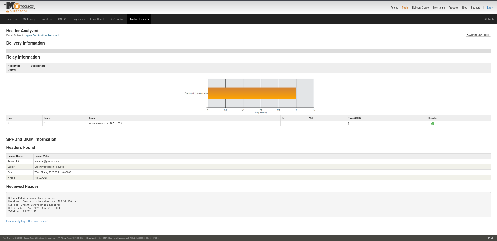

# Task 2 – Phishing Email Analysis | Elevate Labs Cybersecurity Internship

##  Objective
Analyze a phishing email to identify key threat indicators like spoofed sender addresses, malicious links, header anomalies, and psychological manipulation techniques.

---

##  Files Included
- `phishing_email.txt`: Sample phishing email content
- `email_header.txt`: Simulated email header for analysis
- `README.md`: This report

---

##  Phishing Indicators Found

| Indicator | Description |
|----------|-------------|
|  **Spoofed Email Address** | Sender uses `support@paypai.com` instead of the official `@paypal.com` domain. |
|  **Malicious Link** | URL points to `http://paypal-account-verify.com`, a fake domain likely used for credential harvesting. |
|  **Urgent Language** | Message says: “Your account has been temporarily suspended” and warns of permanent lockout within 24 hours. |
|  **Generic Greeting** | Begins with “Dear Customer” instead of addressing the user by name. |
|  **Grammar/Spelling Issues** | Phrases like “verify your informations” or awkward sentence structure are red flags. |
|  **Header Anomalies** | Header shows sender IP as `198.51.100.1` (suspicious), and the domain does not align with PayPal's infrastructure. |
|  **Social Engineering** | Uses fear and urgency to pressure the victim into clicking the link immediately. |

---

##  Tools Used
- Manual content analysis
- [MXToolbox Email Header Analyzer](https://mxtoolbox.com/EmailHeaders.aspx)
- Public phishing email resources

---

##  Outcome
- Gained practical knowledge of how phishing emails are crafted
- Learned how to detect email-based threats through sender analysis, link inspection, and header verification
- Recognized social engineering tactics used in phishing attacks

---

## Screenshots

###  Phishing Email Preview
This screenshot shows a simulated phishing email with spoofed sender, urgency, and malicious link.

###  Email Header Scan – MXToolbox
This screenshot shows the results of scanning the email header using MXToolbox, highlighting anomalies in Return-Path and originating IP.

## Disclaimer
This analysis is for educational purposes only. The email content and headers are simulated and not part of any real phishing campaign.

---

##  Completed by
**ReconNinja7**  
GitHub: [https://github.com/ReconNinja7](https://github.com/ReconNinja7)
